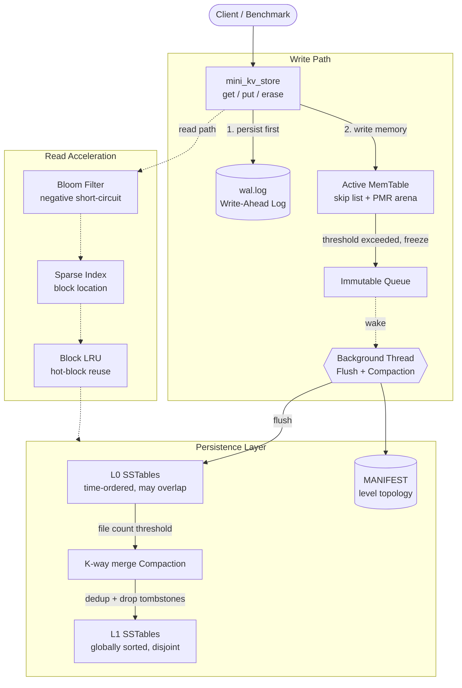

<div align="center">

**English | [中文](README_ZH.md)**

# Mini-LevelDB

**An educational embedded LSM-tree key-value engine in C++20, inspired by LevelDB's architecture.**

This project has its own API and file formats; it does not provide LevelDB API or file compatibility.

[](https://github.com/Byte-Naut/Mini-LevelDB/actions/workflows/ci.yml)
[](https://en.cppreference.com/w/cpp/20)
[](https://cmake.org/)
[](LICENSE)

</div>

---

A self-contained persistence stack: WAL, skip-list MemTable, SSTables, Bloom filters, sparse index, Block LRU cache, and background L0-to-L1 compaction — no third-party storage dependencies. CMake builds the `mini_leveldb` library, a demo, regression tests, and a benchmark.

## Contents

- [Architecture](#architecture)
- [Build and test](#build-and-test)
- [Use the library](#use-the-library)
- [Storage and recovery](#storage-and-recovery)
- [Design notes](#design-notes)
- [Verification and CI](#verification-and-ci)
- [Reproduce benchmarks](#reproduce-benchmarks)
- [Project layout and limits](#project-layout-and-limits)

---

## Architecture


```mermaid
flowchart TB
    Client([Client / Benchmark]) --> API["mini_kv_store\nget / put / erase"]

    subgraph Write["Write Path"]
        direction LR
        API -->|1. persist first| WAL[("wal.log\nWrite-Ahead Log")]
        API -->|2. write memory| MT["Active MemTable\nskip list + PMR arena"]
        MT -->|threshold exceeded, freeze| IMM["Immutable Queue"]
        IMM -.wake.-> BG{{"Background Thread\nFlush + Compaction"}}
    end

    subgraph Disk["Persistence Layer"]
        direction LR
        BG -->|flush| L0["L0 SSTables\ntime-ordered, may overlap"]
        L0 -->|file count threshold| CMP["K-way merge Compaction"]
        CMP -->|dedup + drop tombstones| L1["L1 SSTables\nglobally sorted, disjoint"]
        BG --> MANIFEST[("MANIFEST\nlevel topology")]
    end

    subgraph Cache["Read Acceleration"]
        direction LR
        BLOOM["Bloom Filter\nnegative short-circuit"]
        INDEX["Sparse Index\nblock location"]
        LRU["Block LRU\nhot-block reuse"]
    end

    API -.read path.-> BLOOM -.-> INDEX -.-> LRU -.-> Disk
```

**Write path**

```
put(key, value)
   │
   ├─① append_to_wal()     — write + flush WAL first; crash-recoverable
   ├─② MemTable.insert()   — skip-list insert, O(log N)
   └─③ capacity probe      — if threshold exceeded: freeze into Immutable Queue,
                              background thread flushes async, foreground returns immediately
```

**Read path** — cascade, return on first hit

```
get(key)
   │
   ├─① Active MemTable       — most recent data, shared_lock
   ├─② Immutable Queue       — reverse-order scan of tables awaiting flush
   ├─③ L0 SSTables           — reverse publication order (files may overlap)
   └─④ L1 SSTables           — upper_bound binary search for the one candidate file
            │
            ├─ Bloom Filter   — definitely absent → short-circuit, zero disk I/O
            ├─ Sparse Index   — locate the data block offset for this key
            └─ Block LRU      — cache hit: return from memory; miss: read disk + fill
```

---

## Build and test

Requires CMake 3.20 or newer and a C++20 compiler such as GCC 13 or Clang 16. Linux and native Windows with MinGW GCC are supported. Ninja is optional. On Windows, put the compiler and its runtime DLL directory on `PATH` and use the `.exe` suffix for programs below.

```sh
cmake -S . -B build -DCMAKE_BUILD_TYPE=Debug
cmake --build build --parallel 2
ctest --test-dir build --output-on-failure
./build/mini_leveldb_demo ./demo-data
```

The demo checks `put`, `get`, `erase`, explicit `close`, and reopening the same database, storing files in the supplied directory.

For incremental verification, rebuild the affected target and select the relevant tests:

```sh
cmake --build build --target mini_leveldb_tests --parallel 2
ctest --test-dir build -R 'engine.(tombstone|wal_replay|flush_crash_recovery)' --output-on-failure
ctest --test-dir build -L integration --output-on-failure
```

`BUILD_TESTING=OFF` disables the test executable. `MINI_LEVELDB_BUILD_BENCHMARK=OFF` disables the benchmark. The library and demo remain available.

---

## Use the library

Link to `mini_leveldb::mini_leveldb` after `add_subdirectory`, or install the package:

```sh
cmake --install build --prefix ./install
```

An installed consumer uses:

```cmake
find_package(mini_leveldb CONFIG REQUIRED)
add_executable(app app.cpp)
target_link_libraries(app PRIVATE mini_leveldb::mini_leveldb)
```

Set `CMAKE_PREFIX_PATH` to the installation directory when configuring that consumer. The target carries its include paths, C++20 requirement, and thread dependency.

```cpp
#include "db/includes/mini_kv_store.h"

mini_kv_store store;                    // database files in the working directory
store.put("hello", "world");
std::string value = store.get("hello");
store.erase("hello");
store.close();                         // reports flush or publication failures
```

Keep the object alive while concurrent calls and `close()` execute. `close()` waits for admitted calls, drains pending tables, joins the background worker, and rejects subsequent operations with `std::runtime_error`. Repeated successful closes are harmless. The destructor attempts cleanup; use explicit `close()` when the caller must observe an I/O error.

---

## Storage and recovery

Writes append and flush a WAL record before updating the active MemTable. Both puts and deletions can rotate a full table into the immutable queue. The worker writes an SST and publishes its manifest entry before removing that table from the queue.

Reads search the active table, immutable tables, L0 files in reverse publication order, and L1. A tombstone stops lookup. Compaction selects the highest sequence number for each key and merges all L0 and L1 inputs; it can discard tombstones because all older files in those levels participate. Readers retain access to the old files until replacement completes.

Opening a database rebuilds the manifest and caches, restores sequence numbers from SST records, and replays complete WAL records. Recovery trims an incomplete WAL tail before accepting more writes. The worker retains the WAL throughout the open session. A successful close flushes all admitted data, publishes metadata, and then clears the WAL. This policy trades WAL growth during a long session for straightforward recovery.

These guarantees cover the tested process-crash scenarios. The implementation uses C++ stream flushing and does not promise power-loss durability through `fsync` or `FlushFileBuffers`. The tests terminate child writers without running destructors, then reopen their files.

---

## Design notes

These notes explain why the code is shaped the way it is, so the source is easier to follow.

| Decision | Why |
|---|---|
| Skip list over red-black tree | Forward iteration is free; no rotations; nodes fit naturally in a PMR arena |
| 56-bit seq + 8-bit type packed into one `uint64` | One integer comparison gives correct ordering — newer wins, put ≠ delete |
| WAL held open for the whole session | Recovery stays a single linear replay with no branching; simplicity over bounded WAL size |
| 4 KB MemTable flush threshold | Small enough that test datasets reliably exercise flush and compaction paths |
| L0 linear scan, L1 binary search | L0 files can overlap (each flush is independent); L1 files are disjoint after compaction |
| Full L0+L1 compaction only | Covering every file in those levels makes tombstone discard unconditionally safe |
| No checksums, fsync, snapshots, or iterators | Omitting them keeps the core LSM flow legible without surrounding safety machinery |

**Skip list for the MemTable.** A skip list sorts records by key and supports forward iteration, which is exactly what the SST flush needs: scan every record in order and write it out. A red-black tree would also work, but skip lists require less implementation machinery — no rotations, and insertion only needs to update a flat array of forward pointers. The level cap is 16 with a 0.25 promotion probability (see [mem_table.h lines 73–74](mem_table/includes/mem_table.h#L73-L74)), keeping average path length at about log₄(n). Nodes are allocated from a PMR monotonic arena rather than the heap, so the entire MemTable is freed in one call when the table is discarded after a flush.

**Internal key format.** Every record stored in the skip list or an SST carries an internal key: the user key followed by a 64-bit pack value where the upper 56 bits hold the sequence number and the lower 8 bits hold the operation type (see [mem_table.cpp line 155](mem_table/mem_table.cpp#L155)). A single integer comparison then orders records correctly — same user key sorts newer sequences first, and a put and a delete for the same key at the same sequence are distinct values. The sequence number is capped at 56 bits (see [mini_kv_store.cpp line 213](db/mini_kv_store.cpp#L213)), giving 72 quadrillion operations before rollover.

**WAL lifecycle.** The WAL stays open for the entire database session and is never rotated mid-session. On a clean close, the engine flushes all admitted data to SSTs, publishes the manifest, and truncates the WAL to zero. If the process crashes, recovery reads the WAL, replays every complete record into the active MemTable, and trims any incomplete tail before opening for writes (see [mini_kv_store.cpp lines 26–61](db/mini_kv_store.cpp#L26-L61)). The trade-off is that a very long session accumulates a large WAL, but the recovery path stays simple: there is only one WAL and it either replays cleanly or gets trimmed.

**Flush threshold and SST layout.** The MemTable flushes at 4 KB (see [mini_kv_store.h line 38](db/includes/mini_kv_store.h#L38)), intentionally small so that small test datasets still exercise the flush and compaction paths. Each SST is written in three sequential sections: data blocks (4 KB pages, one sparse index entry per page boundary), an index block listing the first key and offset of each page, and a Bloom filter block. A 16-byte footer closes the file with the byte offsets of those two blocks. The read path therefore only needs to seek twice before reaching the right data block: once to read the footer, once to jump to the target page.

**L0 scan versus L1 binary search.** L0 files can overlap — each flush produces a new file without regard for key ranges already in L0 — so a read must check every L0 file in reverse publication order and stop at the first match or tombstone. L1 files are produced by compaction, which merges all L0 and L1 inputs and sorts the output, so no two L1 files share a key range. A read into L1 uses `upper_bound` on the per-file first keys to find the one candidate file in O(log n) (see [mini_kv_store.cpp lines 162–173](db/mini_kv_store.cpp#L162-L173)).

**Tombstones and compaction scope.** Deleting a key writes a tombstone rather than removing existing data. The tombstone propagates from the MemTable to L0 and then to L1. It is only safe to discard it during a compaction that includes every file that could hold an older version of the same key. Because the current engine runs full L0-to-L1 compaction — all L0 and L1 files participate — it can always discard tombstones at that point. Compaction beyond L1 is not implemented.

**What is left out deliberately.** The engine omits checksums, `fsync` durability, snapshots, range iterators, configurable options, and bounded WAL rotation. These are the features that make a production storage engine substantially more complex. Leaving them out keeps the core LSM data flow — write to WAL, buffer in skip list, flush to SST, compact across levels — legible without the surrounding safety and tunability machinery.

**Performance flamegraph.** The files in `docs/` were captured with `perf record -F 299 -g --call-graph fp` on the benchmark, then processed with FlameGraph. They are historical illustrations — record the source revision, compiler, and machine alongside any result you publish.

[](docs/flamegraph.svg)
<sub>Click for the interactive SVG version</sub>

---

## Verification and CI

CTest registers 16 engine cases: CRUD, disk tombstones, reopen, MemTable flush, compaction, multiple versions, concurrent close/write, WAL replay, process-crash recovery, crash after flush, incomplete WAL tails, versions after reopen, empty keys, all-deleted compaction, concurrent reads during compaction, and I/O failure recovery. Seven cases carry the `integration` label. Tests use independent temporary directories and require successful assertions; they work without GoogleTest or network downloads.

[GitHub Actions](https://github.com/Byte-Naut/Mini-LevelDB/actions/workflows/ci.yml) defines GCC, Clang, and Clang ASan/UBSan jobs on Linux. Each job builds, runs CTest, exercises the demo and benchmark correctness check, installs the library, and uploads test logs. The CI badge reflects workflow state.

To reproduce sanitizer checks on Linux:

```sh
cmake -S . -B build-asan -DCMAKE_BUILD_TYPE=Debug -DCMAKE_CXX_COMPILER=clang++ -DMINI_LEVELDB_SANITIZERS=ON
cmake --build build-asan --parallel 2
ASAN_OPTIONS=detect_leaks=1:halt_on_error=1 UBSAN_OPTIONS=halt_on_error=1 ctest --test-dir build-asan --output-on-failure
```

Optional Valgrind checks require a local installation. No continuous zero-leak claim is made for untested versions:

```sh
valgrind --leak-check=full --error-exitcode=1 ./build/mini_kv_bench --correctness
```

---

## Reproduce benchmarks

The source is `db/bench/mini_kv_bench.cpp`, CMake target `mini_kv_bench`:

```sh
cmake -S . -B build-release -DCMAKE_BUILD_TYPE=Release -DBUILD_TESTING=OFF
cmake --build build-release --target mini_kv_bench --parallel 2
./build-release/mini_kv_bench --correctness
./build-release/mini_kv_bench --ops 8000 --keys 1000 --value-size 64 --seed 42
./build-release/mini_kv_bench --scenario mixed --read-ratio 60 --delete-ratio 10 --ops 8000 --keys 1000 --value-size 64 --seed 42
```

Every scenario starts with a fresh temporary database and removes it after closing. A seeded operation generator makes the workload reproducible. CSV output includes throughput, per-operation P50/P95/P99 latency in microseconds, `get_misses`, and `mismatches`. Expected misses after deletion are separate from incorrect values; a mismatch or failed correctness check causes a nonzero exit. Numeric arguments are validated.

Latency measures individual engine calls. Throughput measures the operation loop, including expected-value checks, and excludes warm-up and final close. Record the source revision, compiler, build type, machine, and filesystem with any published result. Flamegraph files in `docs/` are historical illustrations, not current measurements.

---

## Project layout and limits

`db/` contains the engine, serialization headers, and benchmark. `mem_table/` contains the skip list and arena allocation. `examples/` contains the demo; `tests/` contains the CTest assertions; `cmake/` contains the installed package configuration; `.github/workflows/` contains CI. The unused `server/includes/wire_protocol.h` remains a protocol sketch. No network service is built.

The current API returns an empty string for a missing key, deletion, or stored empty value. One live store owns a database working directory; concurrent processes or multiple store objects sharing that directory are outside the supported contract. The caller must keep that working directory fixed while a store is open. Compaction currently merges L0 into L1; additional levels, bounded WAL rotation during an open session, and stronger corruption and power-loss handling remain future work.

---

<div align="center">

**Mini-LevelDB** · An educational LSM-tree engine in modern C++

If this project helped you understand how storage engines work, a Star ⭐ is appreciated.

Released under the [MIT License](LICENSE).

</div>
