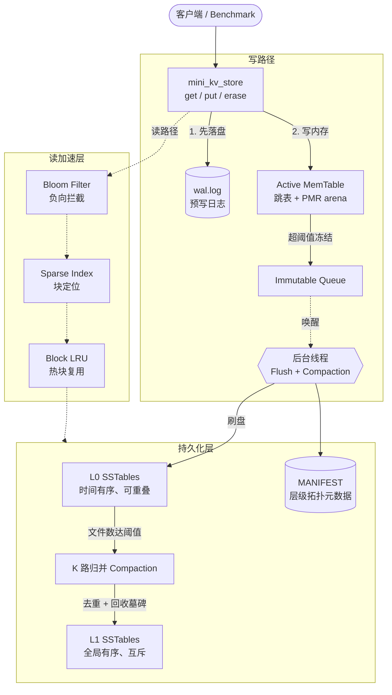

<div align="center">

**[English](README.md) | 中文**

# Mini-LevelDB

**一个使用 C++20 从零实现的教学用嵌入式 LSM-tree 键值引擎，参考 LevelDB 的架构。**

项目使用自己的 API 和文件格式，不提供 LevelDB API 或文件兼容性。

[](https://github.com/Byte-Naut/Mini-LevelDB/actions/workflows/ci.yml)
[](https://en.cppreference.com/w/cpp/20)
[](https://cmake.org/)
[](LICENSE)

</div>

---

完整的持久化链路：WAL、跳表 MemTable、SSTable、布隆过滤器、稀疏索引、Block LRU 缓存和后台 L0 到 L1 compaction，无第三方存储依赖。CMake 提供独立的 `mini_leveldb` 库、demo、回归测试和 benchmark。

## 目录

- [架构设计](#架构设计)
- [构建与测试](#构建与测试)
- [使用库](#使用库)
- [存储与恢复](#存储与恢复)
- [设计说明](#设计说明)
- [验证与 CI](#验证与-ci)
- [复现 benchmark](#复现-benchmark)
- [项目结构与边界](#项目结构与边界)

---

## 架构设计



**写路径**

```
put(key, value)
   │
   ├─① append_to_wal()     — 先写并 flush WAL，保证崩溃可恢复
   ├─② MemTable.insert()   — 跳表插入，O(log N)
   └─③ 容量探针            — 超过阈值则冻结入 Immutable Queue，
                              后台线程异步刷盘，主线程立即返回
```

**读路径** — 逐层穿透，命中即返回

```
get(key)
   │
   ├─① Active MemTable       — 最新数据，shared_lock 共享读
   ├─② Immutable Queue       — 逆序遍历正在刷盘的冻结表
   ├─③ L0 SSTables           — 逆发布时间扫描（文件间可能重叠）
   └─④ L1 SSTables           — upper_bound 二分定位唯一候选文件
            │
            ├─ Bloom Filter   — 判定不存在则短路，零磁盘 I/O
            ├─ Sparse Index   — 定位 key 所属数据块偏移
            └─ Block LRU      — 命中则复用，未命中才读盘并回填
```

---

## 构建与测试

需要 CMake 3.20 及以上版本，以及支持 C++20 的编译器，例如 GCC 13 或 Clang 16。支持 Linux 和使用 MinGW GCC 的原生 Windows 环境，Ninja 为可选构建工具。Windows 用户需要将编译器及其运行时 DLL 目录加入 `PATH`，并为下面的可执行程序添加 `.exe` 后缀。

```sh
cmake -S . -B build -DCMAKE_BUILD_TYPE=Debug
cmake --build build --parallel 2
ctest --test-dir build --output-on-failure
./build/mini_leveldb_demo ./demo-data
```

demo 会检查 `put`、`get`、`erase`、显式 `close` 和重新打开，并在指定目录保存数据库文件。

修改后可按目标增量构建，再选择相关测试：

```sh
cmake --build build --target mini_leveldb_tests --parallel 2
ctest --test-dir build -R 'engine.(tombstone|wal_replay|flush_crash_recovery)' --output-on-failure
ctest --test-dir build -L integration --output-on-failure
```

`BUILD_TESTING=OFF` 可以关闭测试目标，`MINI_LEVELDB_BUILD_BENCHMARK=OFF` 可以关闭基准目标；库和 demo 仍可构建。

---

## 使用库

通过 `add_subdirectory` 引入项目后，链接 `mini_leveldb::mini_leveldb`。也可先安装：

```sh
cmake --install build --prefix ./install
```

安装后的消费者项目使用以下配置，并在配置时将 `CMAKE_PREFIX_PATH` 指向安装目录：

```cmake
find_package(mini_leveldb CONFIG REQUIRED)
add_executable(app app.cpp)
target_link_libraries(app PRIVATE mini_leveldb::mini_leveldb)
```

导出的 target 会提供头文件目录、C++20 要求和线程依赖。

```cpp
#include "db/includes/mini_kv_store.h"

mini_kv_store store;                    // 数据库文件位于当前工作目录
store.put("hello", "world");
std::string value = store.get("hello");
store.erase("hello");
store.close();                         // 让调用方观察刷盘或元数据发布错误
```

并发调用和 `close()` 期间应保持对象存活。`close()` 等待已经进入的操作完成，排空待刷盘的表，等待后台线程退出；关闭后的操作抛出 `std::runtime_error`。成功关闭后可以再次关闭。析构函数会尝试清理；需要获知 I/O 错误时应显式调用 `close()`。

---

## 存储与恢复

写入先追加并刷新 WAL，再更新活跃内存表。写值和写删除标记都可以触发内存表冻结。后台线程写完 SST 并发布 MANIFEST 后，才从不可变队列移除对应表。

读取依次查询活跃表、不可变表、按发布顺序倒序排列的 L0 文件和 L1。命中 tombstone 后立即停止查询。compaction 合并全部 L0 和 L1 输入，并为相同 key 选择最大的序列号；这些层级中的旧文件全部参与合并，因此可以回收 tombstone。读取期间旧文件仍保持可用，替换完成后再删除。

打开数据库时会恢复 MANIFEST 和缓存，从 SST 恢复序列号，并回放完整 WAL 记录。WAL 尾部存在未完成记录时，先裁剪尾部再接受新写入。后台线程在数据库打开期间保留 WAL；成功关闭会刷完所有已接受的数据，发布元数据，再清空 WAL。这种策略允许长时间打开时 WAL 增长，以简化恢复顺序。

验证范围包含进程崩溃恢复。当前实现使用 C++ 流刷新，没有通过 `fsync` 或 `FlushFileBuffers` 提供断电耐久保证。崩溃测试会让子进程跳过析构并退出，然后重新打开它留下的文件。

---

## 设计说明

这部分解释代码结构背后的取舍，帮助读者在阅读源码时更快建立上下文。

**MemTable 选用跳表。** 跳表按 key 排序存储记录，并支持正向遍历，这正是 SST 落盘时所需要的：按顺序扫描所有记录并依次写出。红黑树同样可以，但跳表实现所需的机制更少——不需要旋转操作，插入只需更新一个 forward 指针数组。层级上限为 16，晋升概率为 0.25（`mem_table.h:73-74`），平均查找路径长度约为 log₄(n)。节点从 PMR 单调内存池分配，而不是直接分配到堆上，因此一张 MemTable 在落盘后可以一次性全部释放。

**内部 key 格式。** 跳表和 SST 中存储的每条记录都带有内部 key：用户 key 后面附一个 64 位打包值，高 56 位存序列号，低 8 位存操作类型（`mem_table.cpp:155`）。一次整数比较即可保证正确的排序：相同用户 key 时，序列号更大的记录排在前面；同一序列号下 put 与 delete 是不同的值，不会产生歧义。序列号上限为 56 位（`mini_kv_store.cpp:213`），可支持约 72 千万亿次操作后才会回绕。

**WAL 的生命周期。** WAL 在数据库整个会话期间保持打开，不会中途轮换。正常关闭时，引擎将所有已接受的数据刷入 SST、发布 MANIFEST，然后将 WAL 截断为空。进程崩溃后，恢复流程读取 WAL，将所有完整记录回放到活跃 MemTable，并在接受新写入之前裁剪掉末尾的不完整记录（`mini_kv_store.cpp:26-61`）。代价是长时间打开的会话会积累较大的 WAL，但恢复路径因此保持简单：只有一个 WAL，要么完整回放，要么裁剪尾部。

**落盘阈值与 SST 格式。** MemTable 在达到 4 KB 时触发落盘（`mini_kv_store.h:38`），阈值有意设得很小，这样小规模的测试数据集也能走到落盘和 compaction 的代码路径。每个 SST 由三段顺序写入构成：数据块（每 4 KB 一页，每页起始处记录一条稀疏索引项）、索引块（记录每页第一个 key 及其偏移量）、布隆过滤器块。文件末尾写入 16 字节的 footer，保存这两个块的字节偏移量。读取时只需两次 seek：一次读 footer，一次跳转到目标页，即可定位到正确的数据块。

**L0 全量扫描 vs. L1 二分查找。** L0 的文件之间可能存在 key 范围重叠——每次落盘都直接生成一个新文件，不考虑 L0 中已有文件的 key 范围。因此读取时必须按发布时间逆序遍历所有 L0 文件，遇到第一条匹配或 tombstone 即停止。L1 的文件由 compaction 生成，合并后的结果按 key 全局排序，不同文件的 key 范围不重叠。因此读取 L1 时，用各文件首 key 做 `upper_bound` 即可在 O(log n) 内定位到唯一的候选文件（`mini_kv_store.cpp:162-173`）。

**Tombstone 与 compaction 范围。** 删除一个 key 会写入一条 tombstone 记录，而不是直接移除已有数据。tombstone 随 MemTable 落盘后进入 L0，再经 compaction 进入 L1。只有当某次 compaction 覆盖了所有可能持有该 key 旧版本的文件时，才能安全丢弃 tombstone。由于当前引擎执行全量 L0 到 L1 的 compaction——所有 L0 文件和所有 L1 文件都参与合并——在这一步可以安全丢弃 tombstone。L1 之上的 compaction 暂未实现。

**有意省略的内容。** 引擎没有实现 checksum、`fsync` 持久化保证、快照、范围迭代器、可配置选项和 WAL 有界轮换。这些特性正是让生产级存储引擎显著更复杂的部分。省略它们的目的，是让核心 LSM 数据流——写 WAL、缓冲到跳表、落盘到 SST、跨层 compaction——在没有周边安全和可调节机制的情况下保持可读性。

---

## 验证与 CI

CTest 注册了 16 个引擎场景：CRUD、磁盘 tombstone、重开、MemTable flush、compaction、相同 key 多版本、并发关闭和写入、WAL replay、进程崩溃恢复、flush 后崩溃、WAL 不完整尾部、重开后的版本排序、空 key、全删除 compaction、compaction 期间并发读取，以及 I/O 失败后的恢复。7 个场景带有 `integration` 标签。测试使用独立临时目录并执行实际断言，不依赖 GoogleTest 或网络下载。

[GitHub Actions](https://github.com/Byte-Naut/Mini-LevelDB/actions/workflows/ci.yml) 配置了 Linux GCC、Clang 和 Clang ASan/UBSan 三组任务，每组都会构建、运行 CTest、执行 demo 和 benchmark 正确性检查、安装库，并上传测试日志。CI 徽章显示工作流状态。

在 Linux 下复现 sanitizer 验证：

```sh
cmake -S . -B build-asan -DCMAKE_BUILD_TYPE=Debug -DCMAKE_CXX_COMPILER=clang++ -DMINI_LEVELDB_SANITIZERS=ON
cmake --build build-asan --parallel 2
ASAN_OPTIONS=detect_leaks=1:halt_on_error=1 UBSAN_OPTIONS=halt_on_error=1 ctest --test-dir build-asan --output-on-failure
```

安装 Valgrind 后可自行运行以下命令。项目没有对未测试版本作持续零泄漏承诺：

```sh
valgrind --leak-check=full --error-exitcode=1 ./build/mini_kv_bench --correctness
```

---

## 复现 benchmark

源码位于 `db/bench/mini_kv_bench.cpp`，CMake target 为 `mini_kv_bench`：

```sh
cmake -S . -B build-release -DCMAKE_BUILD_TYPE=Release -DBUILD_TESTING=OFF
cmake --build build-release --target mini_kv_bench --parallel 2
./build-release/mini_kv_bench --correctness
./build-release/mini_kv_bench --ops 8000 --keys 1000 --value-size 64 --seed 42
./build-release/mini_kv_bench --scenario mixed --read-ratio 60 --delete-ratio 10 --ops 8000 --keys 1000 --value-size 64 --seed 42
```

每个场景创建新的临时数据库，关闭后删除；固定种子的操作生成器使负载可复现。CSV 包含吞吐、各操作的 P50/P95/P99 延迟（微秒）、`get_misses` 和 `mismatches`。删除后的预期读缺失与错误返回值分别统计；值不匹配或正确性检查失败会导致非零退出码，数值参数也会验证。

延迟只测量单次引擎调用。吞吐测量操作循环，包含期望值检查，不包含预热和最终关闭。发布结果时应记录源码版本、编译器、构建类型、机器和文件系统。`docs/` 中现有火焰图仅作为历史示意，不能代表当前性能。

---

## 项目结构与边界

`db/` 包含引擎、序列化头文件和 benchmark；`mem_table/` 包含跳表和 arena 分配；`examples/` 包含 demo；`tests/` 包含 CTest 断言；`cmake/` 包含安装配置；`.github/workflows/` 包含 CI。`server/includes/wire_protocol.h` 是尚未使用的协议草案，项目不构建网络服务。

当前 API 用空字符串表示不存在、删除和已存空值。一个数据库工作目录由一个存活的 store 对象持有；多个进程或多个 store 对象同时使用同一目录不在支持范围内。store 打开期间应保持工作目录固定。目前 compaction 只做 L0 到 L1 的合并；更多层级、打开期间有界 WAL 轮换，以及更完善的文件损坏和断电处理仍待实现。

---

<div align="center">

**Mini-LevelDB** · 用现代 C++ 把 LSM-Tree 完整造一遍

如果这个项目对你理解存储引擎有帮助，欢迎 Star ⭐

</div>
